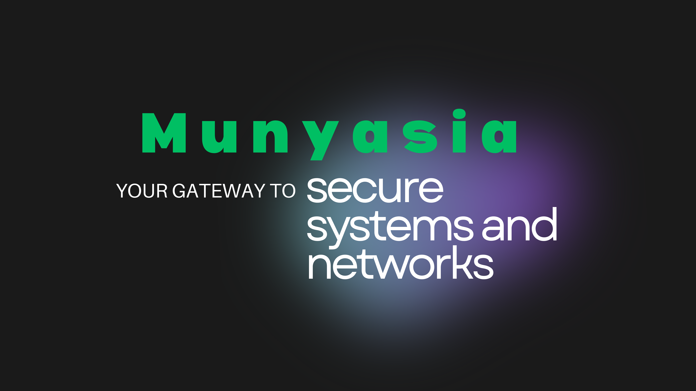

<!-- Optional: Replace with your own banner image -->
<!--  -->

# 👋 Hi, I'm Brian Munyasia Musanga

**Cybersecurity Specialist** · **Full‑Stack Developer** · **Graphic Designer**  
*Building secure systems, crafting clean code, and creating compelling visuals.*

---

## 🧑‍💻 About Me

I'm a Computer Science graduate with hands‑on experience in **cybersecurity**, **full‑stack development**, and **graphic design**. I love solving complex problems—whether it's hardening networks, building intelligent web apps, or designing visuals that tell a story. My background in customer service and teamwork helps me translate technical concepts into user‑friendly solutions.

---

## 🛡️ Cybersecurity

- **Penetration Testing** – TryHackMe (Cyber 101, Pre‑Security, Penetration Testing Path)  
- **Network Analysis & Linux** – Hands‑on labs, reconnaissance, vulnerability identification  
- **Threat Intelligence** – Log analysis, IOC detection, malware activity identification  
- **SOC Fundamentals** – Incident response, monitoring, and reporting

**🛠️ Tools:**  

---

## 💻 Development & AI

- **Full‑Stack Web Apps** – Next.js, Tailwind CSS, PostgreSQL, Firestore  
- **AI Automation** – Google Gemini, LangChain, OCR processing, semantic search  
- **Backend Integration** – Hybrid databases, REST APIs, scalable architectures

**🛠️ Tools:**  

---

## 🎨 Graphic Design

- **Brand Identity & Marketing** – Posters, banners, flyers, social media graphics  
- **Video Editing** – Short campaigns, promotional videos  
- **Client Work** – Increased engagement by 40% for a local client through targeted visuals

**🛠️ Tools:**  

---

## 📌 Featured Work

| Cybersecurity Projects | Development & AI Projects | Graphic Design Projects |
|------------------------|--------------------------|-------------------------|
| 🔒 [TryHackMe PenTest Labs](tryhackme.com) | 🧠 [Jadi – Academic Document Categorizer](link) | 🎨 [Social Media Campaign (40% engagement boost)](link) |
| 📊 [Network Analysis Labs](link) | 🌐 [Panama General Agencies Website](panamageneralagencies.com) | 📹 [Non‑profit Event Video Campaign](link) |
| 🛠️ [IOC Detection & Log Analysis](link) | ⚙️ [OCR + Semantic Search Pipeline](link) | 🖼️ [Branding & Poster Design Portfolio](link) |

*More repositories coming soon…*

---

## 📜 Certifications & Education

- **ISC2 Candidate** – Credly by Pearson  
- **Cybersecurity Certification** – Moringa School  
- **Bachelor's in Computer Science** – Maasai Mara University  
- **TryHackMe** – Cyber 101, Pre‑Security, Penetration Testing Paths

---

## 🤝 Let’s Connect

I'm open to opportunities where I can combine technical security, development, and creative design.  
📫 **Email:** brianmuse624@gmail.com  
💼 **LinkedIn:** [linkedin.com/in/yourprofile](www.linkedin.com/in/brian-munyasia-bm5777)  
🌐 **Portfolio:** *Coming soon*

---

 Optional: GitHub Stats 
 [Brian's GitHub stats](https://github-readme-stats.vercel.app/api?Munyasia=Munyasia&show_icons=true&theme=radical) 
